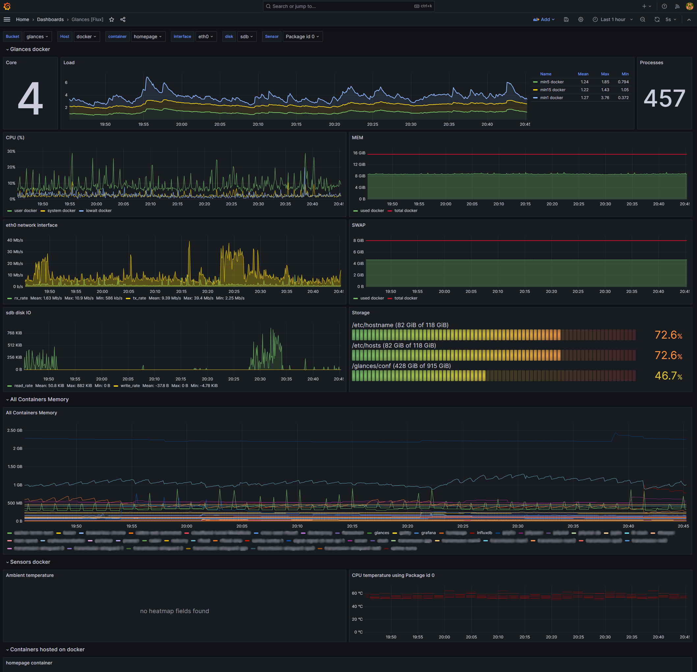

## What does it do?

Displays system monitoring data collected using [Glances](https://github.com/nicolargo/glances) in a Grafana dashboard.

Some of the data displayed:

- System info
- Mount point storage used
- Disk IO
- Sensor temperatures
- Comprehensive table showing all containers memory usage
- Individual tables for each container showing memory and cpu usage

Supports easily changing the data bucket, host and sensors.
Data is sourced from InfluxDB 2.x using Flux.



## Requirements:

For best results you will need:

- Docker environment with your containers you want to monitor
- Glances container
- InfluxDB 2.x container
- Grafana container, configured to use Flux query language with InfluxDB

## How to use it?

1. Deploy 3 docker containers: InfluxDB, Glances, Grafana.
2. If you don't have one yet, deploy a new InfluxDB 2.x server and create a new bucket for glances.
3. Configure your glances.conf file to export data to InfluxDB, this is what the default looks like:
   ```
   [influxdb2]
   host=localhost
   port=8086
   protocol=http
   org=nicolargo **or whatever org you have setup with InfluxDB and Grafana**
   bucket=glances **or the name of the new bucket you just created**
   token=**your token from your new bucket in InfluxDB**
   ```
4. Start Glances with the export flag: `glances --export influxdb2`
5. Open Grafana webui, and navigate to the add a new dashboard. Either copy the dashboard directly from here, or import from [grafana.com](https://grafana.com/grafana/dashboards/23211-glances-flux/).
6. If you don't see data displayed, ensure you have selected the right bucket and host from the dropdowns.

## Credits

Credit to [nicolargo](https://github.com/nicolargo/), the creator of [Glances](https://github.com/nicolargo/glances), for the original dashboard:
[https://grafana.com/grafana/dashboards/2387-glances-for-flux/](https://grafana.com/grafana/dashboards/2387-glances-for-flux/)
